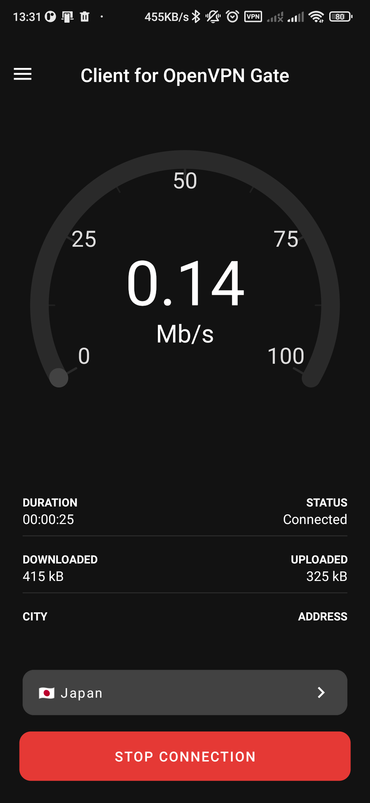
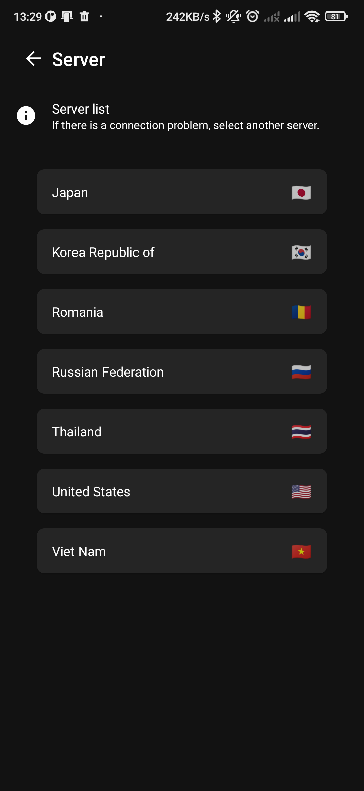
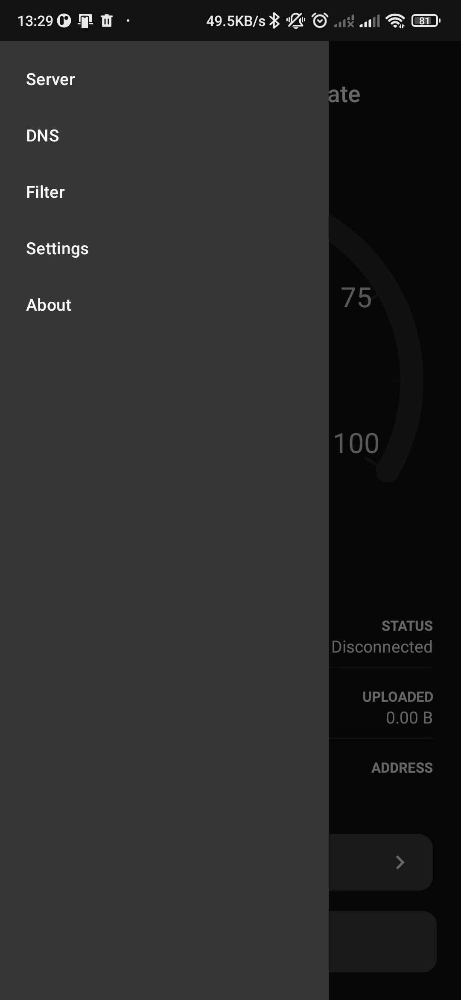

# Client for OpenVPN Gate

[🇬🇧 English](README.md) | 🇷🇺 Русский | [🇵🇱 Polski](README.pl.md)

### Свободный доступ без всяких условий.

Бесплатный VPN-клиент для Android с открытым исходным кодом, работающий на базе сети **VPN Gate**,
которую поддерживает сообщество, — без подписок, без регистрации, без подвоха.

## Почему я это сделал

Меня зовут Егор Заботин. Я родом из Беларуси, а сейчас живу в Польше. Как и многие, кто уехал из
дома, я время от времени всё ещё захожу на сервисы и сайты у себя на родине — и мне не хотелось
платить ежемесячную подписку только ради этого. Так я и нашёл [VPN Gate](https://www.vpngate.net/en/) —
бесплатную волонтёрскую VPN-сеть. Идея отличная, но официальные клиенты показались мне устаревшими
и неудобными. Поэтому я решил сделать свой, получше.

Один момент, о котором стоит сказать честно: это приложение написано в стиле "вайб-кодинга". Я
описывал, что хочу получить, а большую часть кода, тестов и документации писали AI-ассистенты — я же
проверял, направлял и выпускал каждое изменение. Тем не менее это реальное, рабочее и активно
поддерживаемое приложение — просто созданное другим способом, чем большинство.

## Что вы получаете

- **100% бесплатно** — без подписок, без премиум-тарифов, без платных функций.
- **Без регистрации** — открыли приложение и подключились.
- **Никакой торговли данными** — это не "бесплатный" VPN, который на самом деле зарабатывает на
  ваших данных.
- **Открытый исходный код** — весь код клиента здесь, на GitHub, ничего не скрыто.
- **На силах сообщества** — приложение работает на волонтёрской сети
  [VPN Gate](https://www.vpngate.net/en/), а не на серверах одной компании.
- **Подключение в один тап** — выбрали страну и готово.
- **Статус и скорость в реальном времени** — состояние соединения и скорость видны сразу.
- **Автоматическое переподключение** — приложение следит за соединением и само восстанавливает его
  при обрыве.
- **Избранное** — закрепляйте часто используемые страны и серверы для быстрого доступа.
- **Приложение для Android TV** — отдельная сборка, оптимизированная под ТВ, с полной поддержкой
  навигации D-pad/Leanback.

## Скриншоты

  
  
  

## Где скачать

Приложения пока нет в официальных магазинах приложений. На данный момент доступные способы его
получить:

- [GitHub Releases](https://github.com/zabotinegor/OpenVPNGateClientApp/releases) — скачать
  последний APK напрямую.
- [Сайт проекта](https://openvpngateclient.azurewebsites.net) — те же релизы, но с дополнительным
  контекстом.

## Ссылки

- Главная страница: https://openvpngateclient.azurewebsites.net
- Политика конфиденциальности: https://openvpngateclient.azurewebsites.net/privacy-policy
- Условия использования: https://openvpngateclient.azurewebsites.net/terms-of-use
- Лицензия: [GPL-2.0-only](LICENSE)
- GitHub (это приложение): https://github.com/zabotinegor/OpenVPNGateClientApp
- GitHub (VPN-движок): https://github.com/zabotinegor/OpenVPNGateClientEngine

## На основе VPN Gate

Это приложение — клиент для [VPN Gate](https://www.vpngate.net/en/), бесплатной волонтёрской
VPN-сети, которую поддерживает университет Цукуба в Японии. Вся заслуга в том, что серверы вообще
работают, принадлежит этому сообществу — этот проект лишь старается сделать доступ к ним с Android
более удобным.

---

Ищете инструкции по сборке, детали архитектуры или другую техническую документацию? Загляните в
[docs/DEVELOPMENT.md](docs/DEVELOPMENT.md) (на английском языке).
